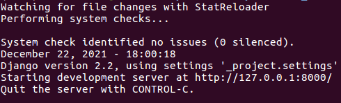

# Proyecto para TrueHome: Activities
Implementar un CRUD con Django Rest Framework en el cual se puedan Agregar nuevas actividades, Re-agendar, Cancelar y Listar las actividades.


## Información y versiones
Python 3.7<br>
Django 2.2<br>
PostgreSQL 9.5


## Archivo .env
En la ruta *src/_project/* crear el archivo .env con los siguientes datos:

```
SECRET_KEY=''

DEBUG=True #True para pruebas False para producción

ALLOWED_HOSTS=[]


DATABASE_ENGINE=django.db.backends.postgresql_psycopg2
DATABASE_NAME=''
DATABASE_USER=''
DATABASE_PASSWORD=''
DATABASE_HOST=localhost #default
DATABASE_PORT=5432 #default
```

## Instalación de primera vez
Para instalar por primera vez el projecto los pasos sugeridos son:

1. Instalar el ambiente virtual (personalmente ocupe *venv*)<br>
`python -m venv tmp/venv`

2. Iniciar el ambiente virtual<br>
`source tmp/venv/bin/activate`

3. Instalar los paquetes<br>
`pip install -r etc/requirements.txt`

4. Ingresar a la carpeta del proyecto<br>
`cd src/`

5. Instalar las migraciones<br>
`python manage.py migrate`

6. Crear el Super Usuario<br>
`python manage.py createsuperuser`

7. Hacer test local de que el proyecto inicia de forma correcta<br>
`python manage.py runserver`

Si las paqueterias y las migraciones se instalaron correctamente debe aparecer el siguiente mensaje:


